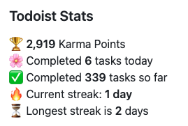

<p align="center">
  
  <h3 align="center">Todoist Stats v2</h3>
</p>

# Todoist Stats v2

Display your Todoist productivity stats in your GitHub profile README. Shows karma points, completed tasks, daily/weekly stats, and streaks.

> **Built on the new Todoist REST API** — fully compatible with Todoist's current API after the Sync API v9 deprecation (February 2026).

## Features

- **Karma points display** - Your current Todoist karma level
- **Daily completed tasks** - Tasks completed today
- **Weekly completed tasks** - Tasks completed this week (Premium users only)
- **Total completed tasks** - All-time completed task count
- **Current streak** - Your current daily streak with encouraging messages
- **Longest streak** - Your historical best streak record
- **Granular tag customization** - Place individual stats anywhere in your README
- **Auto-updates via GitHub Actions** - Set it and forget it

## Quick Start

```yaml
- uses: b00y0h/todoist-readme-v2@v2
  with:
    TODOIST_API_KEY: ${{ secrets.TODOIST_API_KEY }}
```

## Setup

### Step 1: Get Your Todoist API Token

1. Visit [Todoist Integrations Settings](https://todoist.com/prefs/integrations)
2. Scroll to the "API token" section
3. Copy your API token

### Step 2: Add Token as Repository Secret

1. Go to your repository Settings
2. Navigate to **Secrets and variables** > **Actions**
3. Click **New repository secret**
4. Name: `TODOIST_API_KEY`
5. Value: Paste your API token from Step 1

### Step 3: Create Workflow File

Create `.github/workflows/todoist-stats.yml` in your repository:

```yaml
name: Update Todoist Stats
on:
  schedule:
    - cron: '0 0 * * *'  # Daily at midnight UTC
  workflow_dispatch:

jobs:
  update-stats:
    runs-on: ubuntu-latest
    permissions:
      contents: write
    steps:
      - uses: actions/checkout@v4
      - uses: b00y0h/todoist-readme-v2@v2
        with:
          TODOIST_API_KEY: ${{ secrets.TODOIST_API_KEY }}
          PREMIUM: "true"  # Set to "false" for free users
```

### Step 4: Add Tags to Your README

Choose one of two modes:

**Legacy mode** (all stats in one block):
```markdown
<!-- TODO-IST:START -->
<!-- TODO-IST:END -->
```

**Granular mode** (individual stats anywhere):
```markdown
Karma: <!-- TODO-IST-KARMA:START --><!-- TODO-IST-KARMA:END -->
Today: <!-- TODO-IST-DAILY:START --><!-- TODO-IST-DAILY:END -->
This week: <!-- TODO-IST-WEEKLY:START --><!-- TODO-IST-WEEKLY:END -->
Total: <!-- TODO-IST-TOTAL:START --><!-- TODO-IST-TOTAL:END -->
Current streak: <!-- TODO-IST-CURRENT-STREAK:START --><!-- TODO-IST-CURRENT-STREAK:END -->
Best streak: <!-- TODO-IST-LONGEST-STREAK:START --><!-- TODO-IST-LONGEST-STREAK:END -->
```

## Inputs

| Input | Required | Default | Description |
|-------|----------|---------|-------------|
| `TODOIST_API_KEY` | Yes | - | Your Todoist API token from Integrations settings |
| `PREMIUM` | No | `"false"` | Set to `"true"` if you have Todoist Premium (enables weekly stats) |

## Outputs

| Output | Description |
|--------|-------------|
| `stats_updated` | `"true"` if README was updated, `"false"` if no changes |

**Example: Conditional step based on stats update**
```yaml
- uses: b00y0h/todoist-readme-v2@v2
  id: todoist
  with:
    TODOIST_API_KEY: ${{ secrets.TODOIST_API_KEY }}

- name: Notify on update
  if: steps.todoist.outputs.stats_updated == 'true'
  run: echo "Stats were updated!"
```

## Available README Tags

### Legacy Mode (All Stats Together)

Place these tags in your README to show all stats in one block:

```markdown
<!-- TODO-IST:START -->
<!-- TODO-IST:END -->
```

**Output example:**
```
🏆  7,995 Karma Points
🌸  Completed 0 tasks today
✅  Completed 15,300 tasks so far
⏳  Longest streak is 10 days
```

### Granular Mode (Individual Stats)

Place individual stat tags anywhere in your README for custom layouts:

#### Karma Points
```markdown
<!-- TODO-IST-KARMA:START --><!-- TODO-IST-KARMA:END -->
```
Output: `🏆  7,995 Karma Points`

#### Daily Completed Tasks
```markdown
<!-- TODO-IST-DAILY:START --><!-- TODO-IST-DAILY:END -->
```
Output: `🌸  Completed 0 tasks today`

#### Weekly Completed Tasks (Premium Only)
```markdown
<!-- TODO-IST-WEEKLY:START --><!-- TODO-IST-WEEKLY:END -->
```
Output: `🗓  Completed 12 tasks this week`

#### Total Completed Tasks
```markdown
<!-- TODO-IST-TOTAL:START --><!-- TODO-IST-TOTAL:END -->
```
Output: `✅  Completed 15,300 tasks so far`

#### Current Streak
```markdown
<!-- TODO-IST-CURRENT-STREAK:START --><!-- TODO-IST-CURRENT-STREAK:END -->
```
Output: `🔥  You're on a 3 day streak. Keep it going!`

#### Longest Streak
```markdown
<!-- TODO-IST-LONGEST-STREAK:START --><!-- TODO-IST-LONGEST-STREAK:END -->
```
Output: `⏳  Longest streak is 10 days`

**Note:** If you use any granular tags, the legacy `TODO-IST` tags will be ignored.

## Migration Guide

### Migrating from v1 to v2

**Breaking Changes:**

1. **Node.js Runtime Upgraded to Node 20**
   - GitHub deprecated Node 16. v2 uses Node 20.
   - No action required - this is handled automatically by GitHub Actions.

2. **USERNAME Input Removed**
   - **Before (v1):**
     ```yaml
     - uses: abhisheknaiidu/todoist-readme@v1
       with:
         TODOIST_API_KEY: ${{ secrets.TODOIST_API_KEY }}
         USERNAME: ${{ github.repository_owner }}
     ```
   - **After (v2):**
     ```yaml
     - uses: b00y0h/todoist-readme-v2@v2
       with:
         TODOIST_API_KEY: ${{ secrets.TODOIST_API_KEY }}
     ```
   - The committer identity is now auto-detected from GitHub actor. Remove the `USERNAME` input from your workflow.

3. **Todoist API Migration**
   - v2 uses Todoist's unified API v1 (Sync API v9 was deprecated February 10, 2026)
   - Your API token remains the same - no action required.

4. **PREMIUM Input Now Uses String Values**
   - **Before (v1):**
     ```yaml
     PREMIUM: true
     ```
   - **After (v2):**
     ```yaml
     PREMIUM: "true"
     ```
   - Use string `"true"` or `"false"` instead of boolean values.

**New Features in v2:**

- **Granular tag customization** - Place individual stats anywhere (see README Tags section)
- **Current streak display** - Shows your current daily streak with motivational messages
- **Longest streak display** - Shows your all-time best streak
- **`stats_updated` output** - Workflows can detect if README was updated and run conditional steps
- **Improved error handling** - Clear, actionable error messages
- **Skip empty commits** - Only commits when README actually changes

**Upgrade Steps:**

1. Update your workflow file to use `@v2`:
   ```yaml
   - uses: b00y0h/todoist-readme-v2@v2
   ```

2. Remove the `USERNAME` input if present

3. Change `PREMIUM` from boolean to string:
   ```yaml
   PREMIUM: "true"  # or "false"
   ```

4. (Optional) Migrate to granular tags for custom layouts

## License

[](https://creativecommons.org/publicdomain/zero/1.0/)

To the extent possible under law, [Abhishek Naidu](https://abhisheknaidu.tech/) has waived all copyright and related or neighboring rights to this work.

_Inspired by [yg/todoist-box](https://github.com/yg/todoist-box)_

_Inspired by [gautamkrishnar/blog-post-workflow](https://github.com/gautamkrishnar/blog-post-workflow)_
